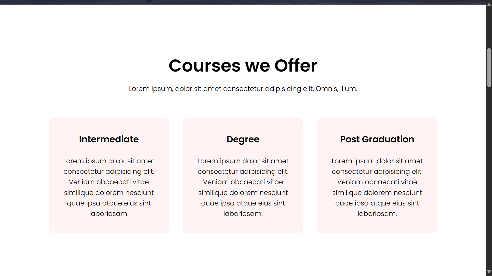
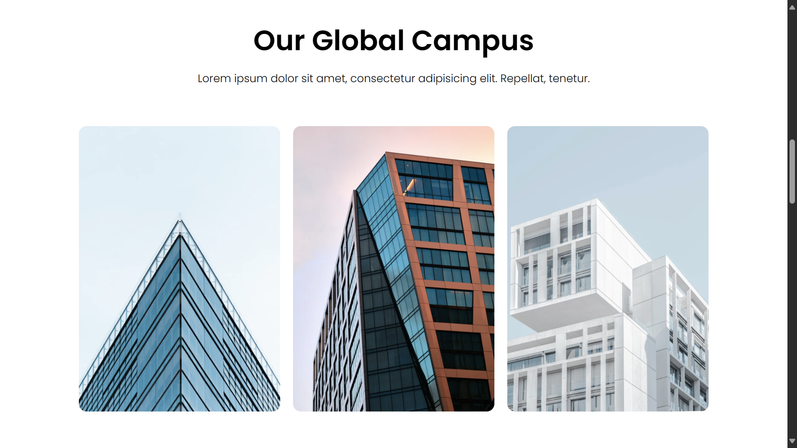
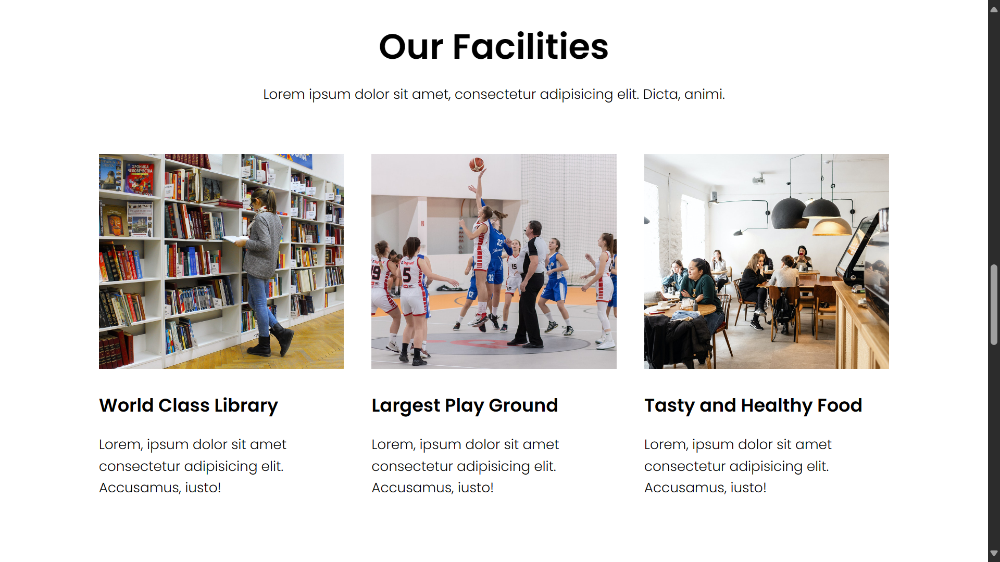
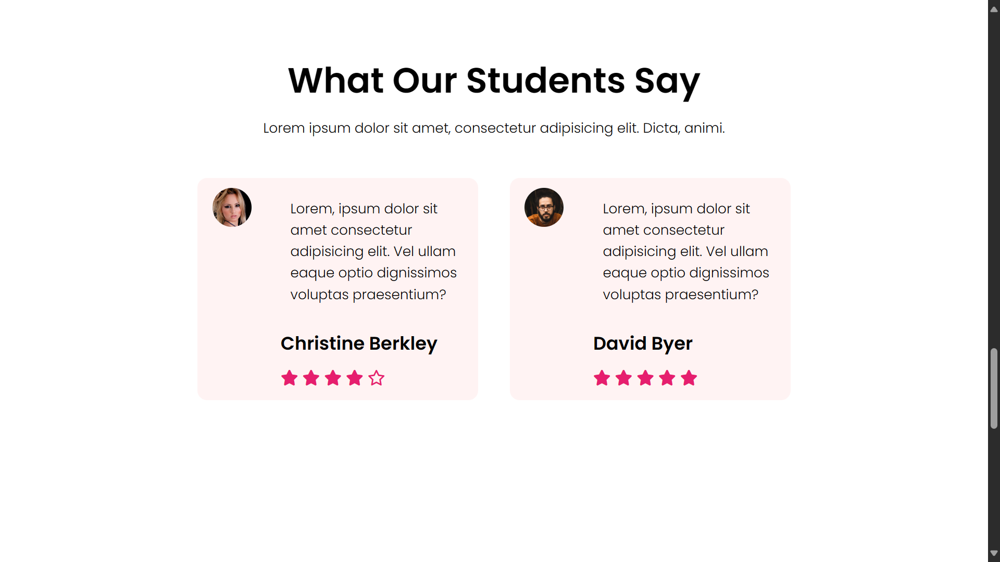

# University Website Project

## Overview
Welcome to the University Website project! This project is a sample university website built using HTML and CSS. It demonstrates a basic structure for a university website, featuring sections like course offerings, facilities, testimonials, and contact details.

## Project URL
Check out the live version of the project here:
[University Website on Netlify](https://world-best-university-edu.netlify.app/)

## Project Screenshots
Here are some screenshots of the website:

## Technologies Used
- HTML
- CSS

## How to Use
If you'd like to run the project locally or contribute to it, follow these steps:

- Clone the repository: git clone https://github.com/Bilal00404/University-Website.git
- Navigate to the project directory: cd University-Website
- Open the project in a browser or use a local development server to view it.

## Contact
If you have any questions or suggestions, feel free to contact me at bilalchanna67@gmail.com.
